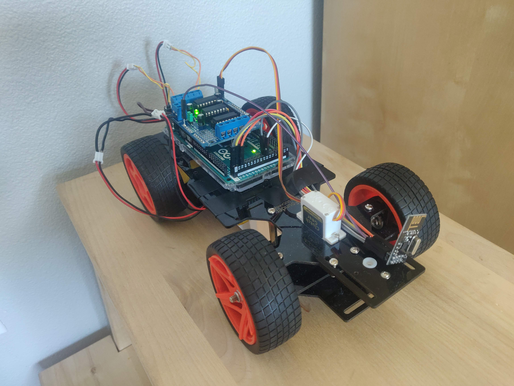
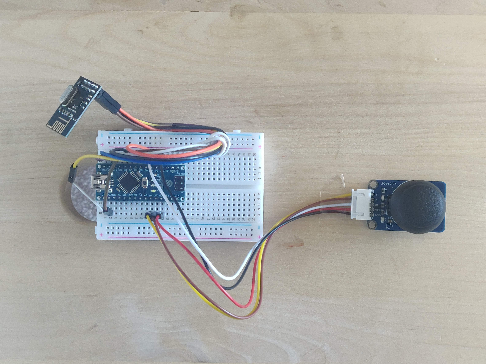

# Arduino Radio-Controlled Car

 
**Disclaimer:**  This personal project is an enhanced iteration of the original "Obstacle Avoiding Car" project, originally created with an Arduino Uno and motors. The goal of this revamped version is to transform it into a remote-controlled car using Arduinos and RF modules. The project aims to achieve wireless control of the car, with the potential to adapt it for use in various hobby RC cars.

## Table of Contents
- [Features](#features)
- [Parts List](#parts-list)
- [Current Build](#current-build)
  - [Transmitting End](#transmitting-end)
  - [Receiving End](#receiving-end)
- [Future Plans](#future-plans)

## Features

Explore the exciting features of this Arduino-based radio-controlled car project:

- Wireless remote control using RF technology.
- Precise control with a dual-axis joystick module for intuitive navigation.
- Real-time transmission of X and Y axis data.
- Integration of NRF24L01 transceiver modules for reliable communication.
- Modular design with the potential to adapt the system for various hobby RC cars.

Stay tuned for future enhancements and features as the project continues to evolve!

## Parts List

Here is the list of components used in the project:

1. PiCar-V Chassis, Motors, and Wheels
2. Two Lithium Polymer batteries rated at 3.7V 2000 mAh
3. L293D Motor Shield for Arduino
4. Half-Size Breadboard
5. Two NRF24L01 Transceiver Modules
6. Arduino Mega 2560
7. Arduino Nano
8. Dual-axis Joystick Module
9. One Servo Motor
10. Soldering Equipment (Necessary for 1 pin in the current build)

## Current Build

### Transmitting End

The transmitting end of the project utilizes an Arduino Nano connected to a dual-axis joystick module. The Nano sends joystick data, including X and Y axis positions, to an Arduino Mega using a pair of NRF24L01 radio modules. 

The joystick's X and Y pins are connected to two Analog In ports on the Nano, which convert the analog data into digital format. This data is then transmitted to the RF receiver on the Arduino Mega.

### Receiving End

The Arduino Mega on the receiving end interprets the X and Y axis data and uses conditional statements to control the car's movement. The L293D shield is employed to connect two DC motors and a servo motor, enabling control over the car's wheels and servo mechanism.

## Future Plans

Here are some plans for future enhancements to the project:
## Future Plans

Here are the future plans for enhancing the project:

1. Design a custom PCB board for the joystick controller to improve handheld control and portability.

2. Implement a simple camera attached to servo motors, allowing for remote-controlled camera movements using a second joystick.

3. Explore recreating the project using a Raspberry Pi, Python, and various sensors to create a versatile tank or rover. This new iteration will leverage the power and flexibility of the Raspberry Pi platform to enhance the project's capabilities and potentially include features like autonomous navigation and real-time video streaming.

Feel free to explore this project, and if you have any questions or suggestions, please don't hesitate to reach out.

## License

This project is released under the [MIT License](LICENSE).

---

Thank you for checking out the Arduino Radio-Controlled Car project!

